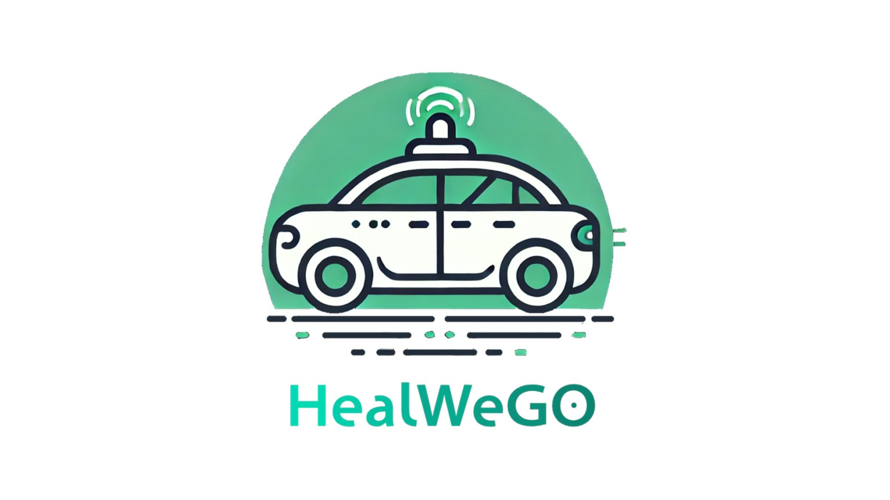
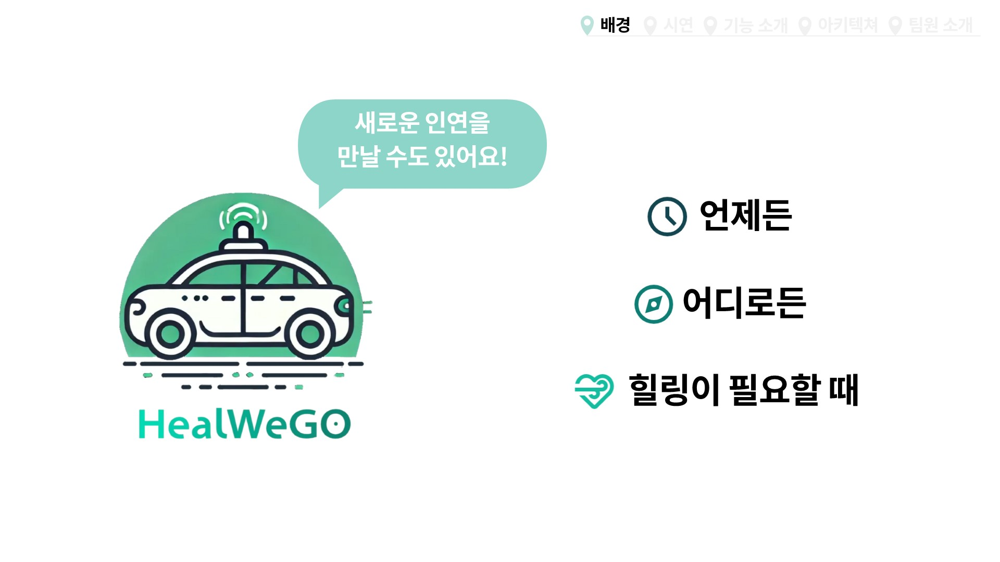
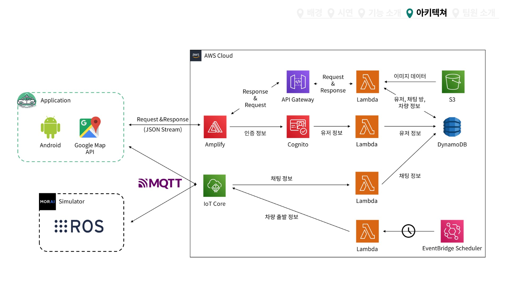
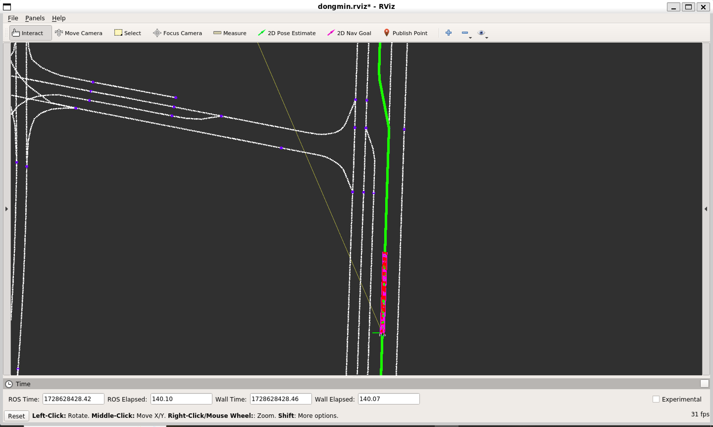
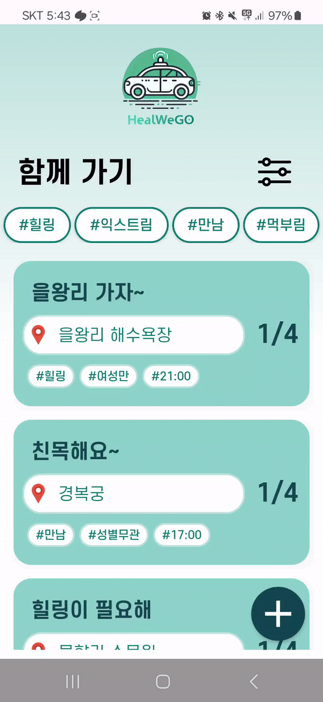
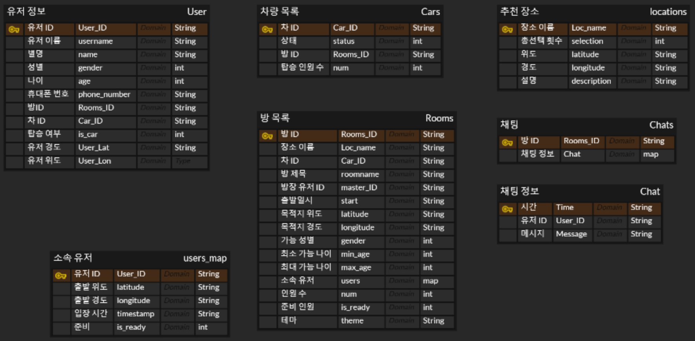
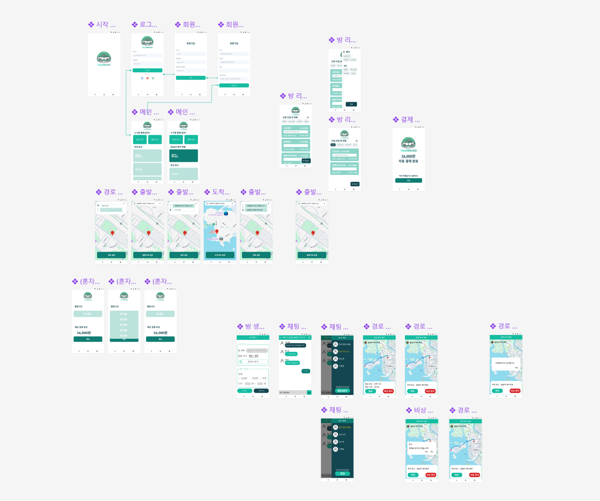

# HealWeGo

  

 
언제든 어디로든 **힐링**이 필요할 땐 
 
힐링 카풀택시 **HealWeGo**

### [UCC 링크](https://www.youtube.com/watch?v=S9VrSzIYWPk)

 
 

## HealWeGo 소개

  

 
HealWeGo는 자율주행 시뮬레이터 MORAI를 활용한 힐링 테마의 자율주행 카풀 택시 서비스입니다. 

 
 

## 시스템 아키텍처

  

 

 
 

## 주요 기능
### 차량
#### ACC(Adaptive Cruise Control)

  

 

- V2X 기술을 이용하여 주변 차량의 속도를 측정합니다.
- 주변 차량 속도와 현재 EGO 차량의 속도로 상대속도를 구합니다. 
- 이를 타겟 속도로 세팅하여 충돌 안전 거리를 유지합니다.

 

#### 신호등 감지

  

 

- EGO 차량 주변 일정 거리 안에 신호등이 들어오면 이를 ROS 통신으로 Signal Value를 수신합니다.
- 경로상의 방향을 비교하여 같을 시에 정상 주행 아닐 시에는 정지선 전에 차량이 정지합니다.

 

#### 장애물 회피

  

 

- EGO 차량 전방에 장애물이 있을 시에 차선 이동을 통해 장애물을 회피합니다.
- 이때, 주변 차량이 있는지 확인하여서 안전거리를 확보한 뒤에 차량이 회피 주행합니다.

 

#### 3D 시각화

  

 

- MORAI 시뮬레이터에서 차량 센서값, 맵데이터를 통해 3D 시각화 Tool(rviz)로 실시간으로 동작 확인이 가능합니다.  

 
 

### 애플리케이션
#### 회원가입 및 로그인 기능
- 로그인 후 성별, 나이, 카드 결제 정보를 등록합니다. 

 

- AWS Amplify
  - 애플리케이션에 사용자 인증 및 권한 부여를 위해 AWS Cognito와 통합
  - 사전 빌드된 인증 모듈을 이용해 사용자 인증 및 권한 부여를 구현

 

- AWS Cognito
  - 사용자를 인증하고 권한을 부여
  - AWS의 보안 인프라를 활용하여 사용자 데이터 및 인증 정보를 안전하게 보호
  - 사후 확인 Lambda 트리거를 이용해 회원가입 및 인증이 이루어진 사용자 정보를 DynamoDB에 저장

 

#### 장소 추천 기능
-  방문자 수 기준으로 가장 높은 5곳의 장소를 추천합니다.

    

        
    
 

 

#### 경로 설정
- 혼자가기 경로 설정
 
(gif)

- 함께가기 출발지 설정
 
(gif)

 

#### 채팅 목록 필터 
- 원하는 여행 테마, 성별 필터에 따라 채팅방을 조회할 수 있습니다. 

    

        
    
 

 

#### 채팅방 생성
- 방 제목, 출발 시간, 목적지 설정, 성별 및 나이 필터, 테마를 설정합니다.

 
(gif)

 

#### 다대다 채팅
- 채팅방에 참여한 사람들은 양방향 채팅을 할 수 있습니다.

    

        
    
 

 

#### 참여자 READY 및 방장 GO 버튼
- 채팅방 참여자는 READY 버튼을 눌러 동행 여부를 확정합니다. 
- 방장은 참여자가 모두 READY를 한 경우 GO 버튼을 눌러 일정을 확정합니다. 

 
(gif)

 

#### 요금 결제
- 혼자가기의 경우 출발 시간을 선택하고, 예상 결제 요금 확인할 수 있습니다. 
- 함께가기의 경우 모든 참여자가 동시에 자동 결제 진행됩니다. 

 
(혼자가기gif)(요금결제gif)

 

#### 실시간 차량 위치 확인
- MORAI와 Android 간 통신으로 차량의 실시간 위치를 확인할 수 있습니다. 
- MORAI 시뮬레이터 내에 GPS센서 값을 rosbridge websocket을 통해 ROS에 전송합니다. 
- ROS와 Android는 AWS IoT Core 를 통해 MQTT통신으로 값을 전송합니다. 

 
(앱 gif)(시뮬레이터 gif)

 

#### 경로 표시
- ROS에서 계산한 최적의 경로를 Android 앱에서 표시합니다.
- ROS에서 Dijkstra 알고리즘으로 최적의 경로를 계산합니다.
- ROS에서 계산한 경로 노드 정보를 Android에서 받은 후 최적화 작업을 거쳐 지도에 표시합니다. 

 
(gif)

 

#### 예약 확인 및 취소
- 일정을 잊지 않도록 예약 확인할 수 있습니다.
- 예약된 일정을 누르면 차량 위치를 확인할 수 있는 지도로 이동할 수 있습니다. 

    

        
    

- 부득이하게 일정을 취소해야 하는 경우 예약을 취소할 수 있습니다. 

    

        
    

 

#### 비상 정지
- 차량 내에서 응급 상황이나 비상 상황이 발생하면 비상 정지를 할 수 있습니다.
- 비상 정지 후 차량이 갓길에 정차하고, 해당 버튼을 누른 사람이 이동 재개 버튼을 누르면 다시 주행을 시작합니다.

 
(gif)

 
 

### 서버

- 서버리스 아키텍처
  - AWS API Gateway
    - 사용자 정보
      - 회원 가입 시 추가 정보를 입력받아 DB 업데이트
      - 예약 현황 확인을 위한 자신의 정보 요청
      - 사용자 출발 위치 정보를 입력받아 DB 업데이트
    - 채팅 방
      - 방 생성 시 생성 정보를 바탕으로 DB 업데이트
      - 방 목록 확인을 위한 요청
      - 방 입장 시 방 정보(참여중인 사용자 정보 등) 요청
      - 참여중인 방 정보 확인을 위한 요청
      - 사용자의 준비 상태(예약 확정을 위한 준비) DB에 업데이트
      - 방 나가기에 대한 DB 업데이트
    - 목적지 추천
      - 주 단위 이용자 수에 따른 추천 장소 정보 요청

     

  - AWS IoT Core
    - MQTT 통신의 브로커 역할 수행
      - 애플리케이션 간 채팅 구현
      - 애플리케이션-시뮬레이터 간 위치 정보 송수신 구현
      - AWS-시뮬레이터 간 출발 신호 송수신 구현
    - 규칙 설정을 통한 DB 업데이트
      - 채팅 관련 topic을 규칙으로 해당 채팅 DB에 업데이트
    
     
  - AWS Eventbridge Scheduler
    - 정시마다 DB를 확인해 차량 출발 신호 송신(mqtt)
      - AWS Lambda 활용

     

  - AWS Lambda
    - API Gateway, IoT Core, Eventbridge Scheduler에 설정된 트리거, 이벤트, 규칙에 대한 응답으로 실행
    - AWS S3, AWS DynamoDB에 저장된 값을 사용자에게 전송 또는 event 파라미터로 수신된 값을 DB에 업데이트

  
 

## ROS - 앱 통신
### 경유지
1. 브로커에서 사용자들의 경유지와 도착지를 *path/points/server/{car_id}* 토픽을 통해 MQTT로 송신한다,
2. MQTT.py에서 해당 String을 파싱하여 str 형태로 */stopovers*토픽을 통해 dikjstra.py로 송신한다.
3. dikjstra.py 코드에서 수신된 경우지들의 순서와 global path를 다익스트라 알고리즘을 통해 결정하고, */ordered* 토픽과 */global_path* 토픽으로 해당 순서와 경로를 MQTT.py로 송신한다.
4. MQTT.py에서 수신된 경로 순서를 기존에 수신된 stopovers 정보와 결합하여 *path/points/ros/{car_id}* 토픽을 통해서 브로커로 MQTT 송신한다.

 

### 차량 위치
1. ACC.py에서 주기적으로 차량의 위치 정보를 */gps* 토픽으로 MQTT.py에 송신한다.
2. MQTT.py에 수신된 gps 신호를 *gps/{car_id}* 토픽으로 MQTT 송신한다.
    
 

### 출발신호, 도착신호
1. 탑승자가 차량에 탑승하면, 브로커에서 MQTT.py로 *signal/app/{car_id}*  토픽을 통해 *boarding* 메세지를 송신한다.
2. MQTT.py에 */global_path* 토픽을 통해 수신된 데이터가 존재한다면, ACC.py로 */departed* 토픽에 True를 송신하여 출발 신호를 보낸다.
3. 특정 경우지에 도착한다면, ACC.py에서 */arrived* 토픽으로 MQTT.py에 True를 보내 도착 신호를 송신한다.
4. MQTT.py 는 수신된 도착 신호가 도착한다면 현재 경우지 순서를 바탕으로 user_id 정보를 파악하고, 이를 통합하여 *signal/ros/{car_id}* 토픽을 통해 브로커로 MQTT 송신한다.
5. 이 때, 만약 최종 목적지가 아니라면 *finished : 0*를, 최종 목적지라면 *finished : 1*을 송신하여 최종 목적지 여부를 확인한다.
    
 

### 긴급 정지
1. 브로커에서 MQTT.py로 *signal/app/{car_id}* 토픽을 통해 *stop* 메세지로 긴급정지 신호를 수신한다.
2. 만약 현재 긴급 정지 상태가 아니라면, MQTT.py에서 dijkstra.py와 ACC.py로 */stopped* 토픽을 통해 True 메세지를 송신하여 긴급 정지 상황임을 알린다.
3. 브로커에서 MQTT.py로 *signal/app/{car_id}* 토픽을 통해 *resume* 메세지로 운행 재개 신호를 수신한다.
4. 만약 현재 긴급 정지 상태가 아니라면, MQTT.py에서 dijkstra.py와 ACC.py로 */stopped* 토픽을 통해 False 메세지를 송신하여 운행 재개 신호를 송신한다.

 
 

## ERD

  

 
 

## 화면 설계 (Figma)

  

 
 

## 사용 기술
### 차량
- MORAI simulator
- ROS
- 속도 제어
    - PID 제어
    - Velocity Planning
- 조향각 제어
    - Pure Pursuit
- 경로 추정
    - Dijkstra

### 애플리케이션
- Figma
- Android
- Java 

### 서버
- AWS 

### 통신
- MQTT

### 협업 툴
- Git
- Jira
- Notion

 
 

## 멤버 소개
|제목|내용|내용|
|-----|-----|-----|
|팀장|한동민|자율주행|
|팀원|강수현|자율주행|
|팀원|강형남|애플리케이션|
|팀원|김경빈|애플리케이션|
|팀원|배윤재|애플리케이션|
|팀원|서현범|자율주행|

